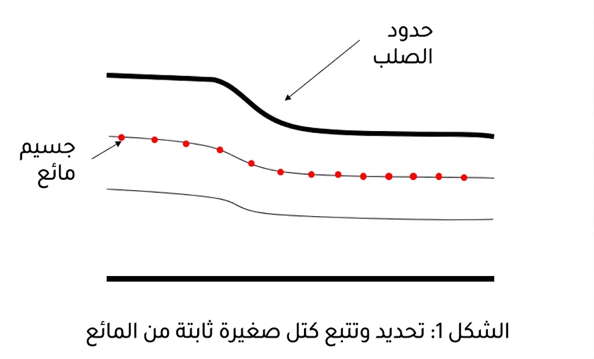

# طريقة لاغرانج

Status: المبدأ
Multi-select: Hydrodynamics

كيفية وصف الإزاحة والسرعة والتسارع لأجزاء المائع.

تتبّع جسيمات سائلة فردية ذات كتلة ثابتة مع مرور الزمن لتحديد السرعة والتسارع. تعتمد على معادلات تفاضلية عادية مقترنة (ODEs)، مثل قانون نيوتن الثاني. وهذا يجعلها مكلفةً حسابيًا في حالة الموائع، ما يحدّ من تطبيقها إلى حدٍّ كبير إلى مسائل محددة مثل تتبع انتشار الملوثات.